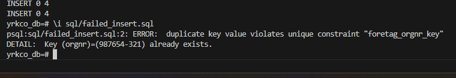

FAILED CONSTRAINT ORGNR DUPLICATE, CAN ONLY BE UNIQUE MISSED ASSIGNMENT

📚 YrkesCo Database Project

This project contains a fully dockerized PostgreSQL database for the fictional vocational school YrkesCo, designed according to modern data modeling principles.

The goal is to replace scattered Excel files and manual tracking with a normalized relational database model that supports students, programs, courses, instructors, companies, facilities, and more.

🚀 Tech Stack

Docker + Docker Compose

PostgreSQL

SQL (DDL + DML)

Lucidchart (for ER modeling)

Optional: Python for scripts / connections

📁 Project Structure
yh_labb/
 ├─ sql/
 │   ├─ ddl.sql        # Creates tables 
 |   ├─ dml.sql        # Insert seed data
 │   ├─ query.sql       # Example join queries
 │
 ├─ docker/
 │   ├─ .env                   # PostgreSQL environment variables
 │   ├─ docker-compose.yml     # Docker services definition
 │
 | presentation.pdf
 │
 ├─ README.md

🗄️ Database Overview

The database contains structured information for:

Students

Courses

Programs

Classes

Educators

Companies

Facilities

Addresses & Countries

Normalization level: 3NF

🧱 Data Modeling Steps (Uppgift 0)

Conceptual Model
High-level ERD describing entities + relationships.

Relationship Statements
Plain language description of M:N, 1:M, etc.

Logical Model
Tables with attributes, PK/FK and cardinalities.

Physical Model
SQL implementation using PostgreSQL.

Normalization to 3NF
Removing redundancy via separate tables (e.g. address, country).

🐳 Running the Project (Docker)
1. Make sure Docker is running

Docker Desktop or CLI is fine.

2. Navigate to the docker folder
cd docker

3. Start PostgreSQL
docker compose up -d

4. Connect to the database

Using psql:

docker exec -it yh_postgres psql -U $POSTGRES_USER -d $POSTGRES_DB

(Names may differ if container names were changed.)

🌱 Seed Data

Tables are automatically populated with sample data from docker-init.sql.

This allows testing of joins such as:

Courses ↔ Programs

Students ↔ Classes ↔ Programs

Educators ↔ Companies

Addresses ↔ Countries

🔍 Example Queries (Uppgift 1.c)

Example queries exist in:

sql/test_queries.sql

Example:

SELECT s.firstname, s.lastname, p.name AS program
FROM student s
JOIN klass k ON s.klass_id = k.id
JOIN program p ON k.program_id = p.id;

🎤 Presentation (Uppgift 2)

Included in:

presentation/uppgift2_presentation.pdf

Contains all required steps:

Conceptual → Logical → Physical model

Normalization to 3NF

Implementation approach

SQL demonstration

✨ Learning Outcomes

By completing this lab, we have practiced:

✔ Data modeling (ERD)
✔ Handling M:N via bridge tables
✔ Working with PK/FK constraints
✔ Normalization to 3NF
✔ Dockerized databases
✔ Seed data + join queries

📌 Future Improvements

Authentication + user roles

API layer (Python / Node / .NET)

Admin dashboard

Expand facility + scheduling features
